# Inventory and Purchase Order API

A RESTful API built using **Node.js**, **Express.js**, **SQLite3**, **JWT Authentication**, and **bcrypt** for managing inventory operations, suppliers, product categories, products, purchase orders, and stock movements.

The API provides secure endpoints for user authentication, inventory management, purchase order processing, stock tracking, and supplier reporting. It follows REST principles and uses JWT-based authentication to protect authorized operations.

---

# Features

* User Registration & Login
* JWT Authentication
* Password Hashing using bcrypt
* Supplier Management
* Category Management
* Product Management
* Purchase Order Management
* Automatic Stock Update
* Low Stock Report
* Stock Movement History
* Supplier-wise Product Report
* SQLite Database
* Input Validation

---

# Technologies Used

* Node.js
* Express.js
* SQLite3
* JSON Web Token (JWT)
* bcrypt
* dotenv

---

# Project Structure

```text
Inventory-and-Purchase-Order-API/
│
├── inventory.db
├── server.js
├── database_config.js
├── .env
├── package.json
├── package-lock.json
└── README.md
```

---

# Installation

## Clone the Repository

```bash
git clone <repository-url>
```

Or download the ZIP file and extract it.

---

## Install Dependencies

```bash
npm install
```

or

```bash
npm install express sqlite3 bcrypt jsonwebtoken dotenv
```

---

# Environment Variables

Create a `.env` file in the project root.

```env
JWT_SECRET=myinventorysecret
```

---

# Run the Project

```bash
node server.js
```

or

```bash
nodemon server.js
```

Server starts at:

```text
http://localhost:3000
```

---

# Database Tables

## Users

* id
* name
* email
* password
* role

## Suppliers

* id
* name
* email
* phone
* city

## Categories

* id
* name

## Products

* id
* name
* sku
* price
* stock_quantity
* reorder_level
* supplier_id
* category_id

## Purchase Orders

* id
* supplier_id
* product_id
* quantity
* order_status
* order_date

## Stock Movements

* id
* product_id
* movement_type
* quantity
* movement_date

---

# API Endpoints

## Authentication

### Register

```http
POST /register
```

Request Body

```json
{
  "name": "John",
  "email": "john@gmail.com",
  "password": "123456"
}
```

---

### Login

```http
POST /login
```

Request Body

```json
{
  "email": "john@gmail.com",
  "password": "123456"
}
```

Returns a JWT Token.

---

## Categories

### Add Category

```http
POST /categories
```

```json
{
  "name": "Electronics"
}
```

---

### Get Categories

```http
GET /categories
```

---

## Suppliers

### Add Supplier

```http
POST /suppliers
```

Authorization

```text
Bearer Token
```

```json
{
  "name": "ABC Suppliers",
  "email": "abc@gmail.com",
  "phone": "9876543210",
  "city": "Mumbai"
}
```

---

### Get Suppliers

```http
GET /suppliers
```

---

## Products

### Add Product

```http
POST /products
```

```json
{
  "name": "Laptop",
  "sku": "LP1001",
  "price": 45000,
  "stock_quantity": 10,
  "reorder_level": 5,
  "supplier_id": 1,
  "category_id": 1
}
```

---

### Get Products

```http
GET /products
```

---

### Get Low Stock Products

```http
GET /products/low-stock
```

---

### Update Product

```http
PUT /products/:id
```

---

### Delete Product

```http
DELETE /products/:id
```

---

## Purchase Orders

### Create Purchase Order

```http
POST /purchase-orders
```

```json
{
  "supplier_id": 1,
  "product_id": 1,
  "quantity": 20
}
```

---

### Update Purchase Order Status

```http
PATCH /purchase-orders/:id/status
```

```json
{
  "order_status": "Received"
}
```

---

## Stock Movements

### Get Stock Movement History

```http
GET /stock-movements
```

---

## Supplier-wise Product Report

### Get Supplier Products

```http
GET /suppliers/:id/products
```

---

# Authentication

All protected APIs require a JWT Token.

Example:

```text
Authorization: Bearer YOUR_JWT_TOKEN
```

---

# Validation

* Required Fields
* Email Format Validation
* Password Length Validation
* Unique Email Validation
* Unique SKU Validation
* Price must be greater than 0
* Stock Quantity cannot be negative
* Reorder Level cannot be negative
* Purchase Quantity must be greater than 0
* Purchase Order Status Validation
* Foreign Key Validation

---

# API Testing (Thunder Client)

The following REST APIs were successfully tested using Thunder Client. The screenshots below show the request and response for each API.

## 1. User Registration

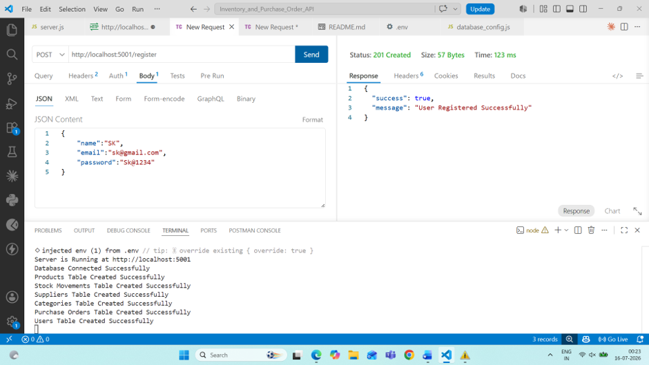

## 2. User Login

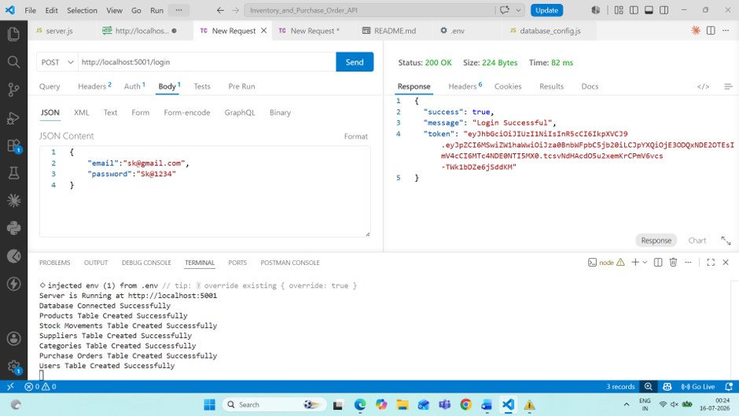

## 3. Add Category

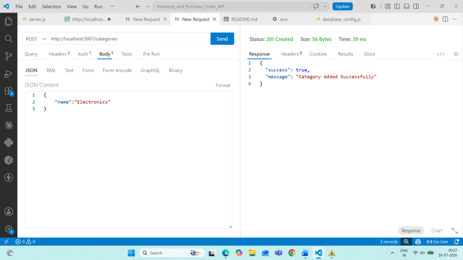

## 4. Get Categories


## 5. Add Supplier


## 6. Get Suppliers

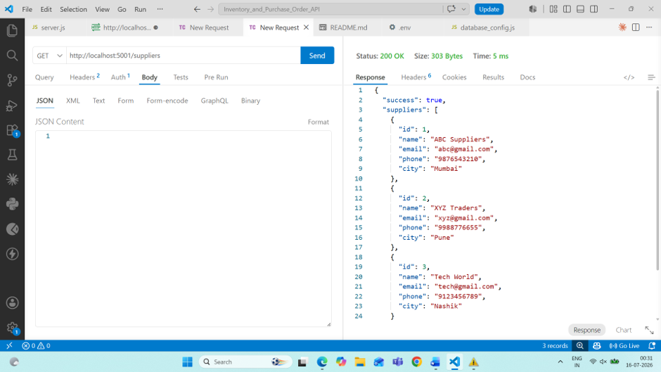

## 7. Add Product

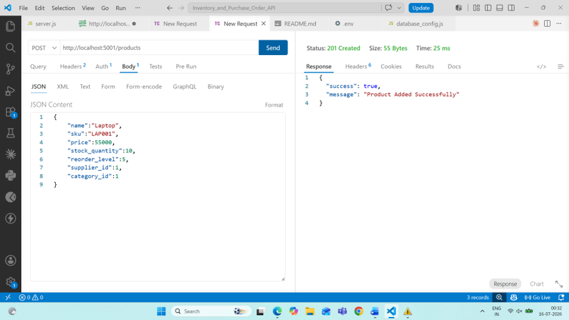

## 8. Get Products

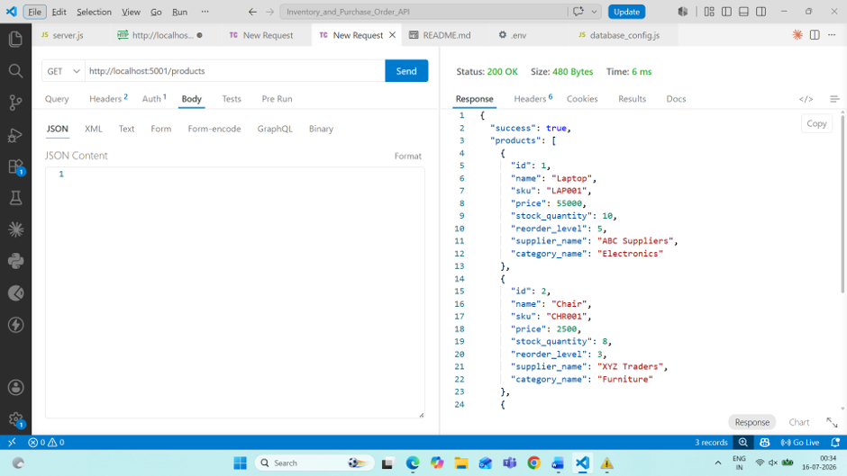

## 9. Get Low Stock Products

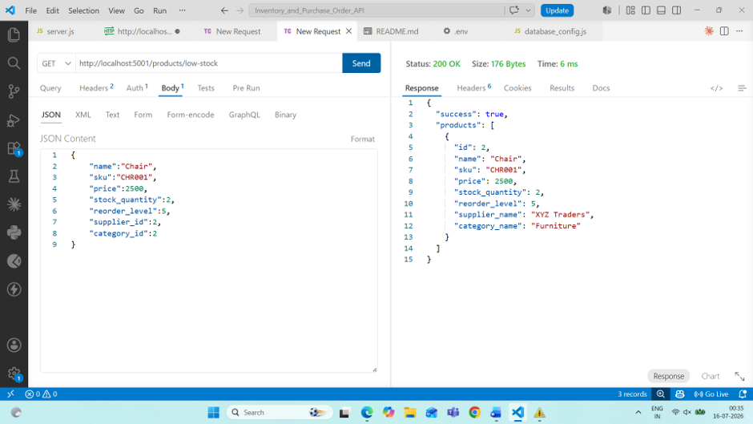

## 10. Update Product

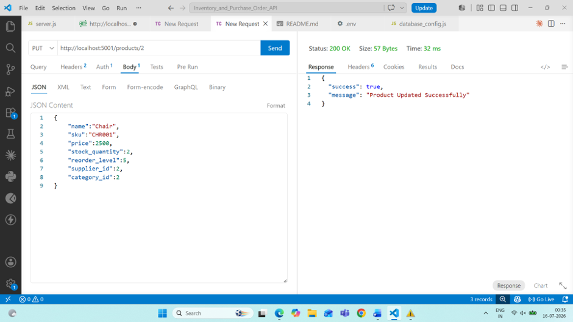

## 11. Low Stock Report After Update


## 12. Create Purchase Order

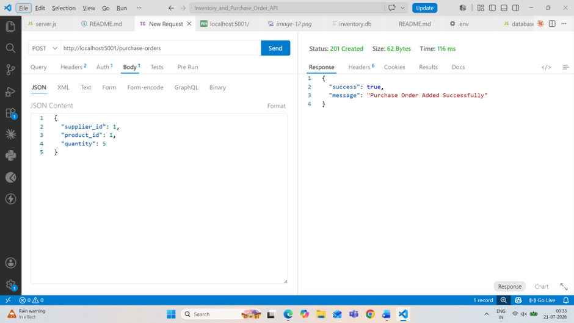

## 13. Update Purchase Order Status

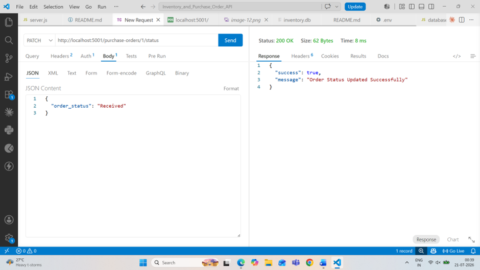

## 14. Updated Product Stock

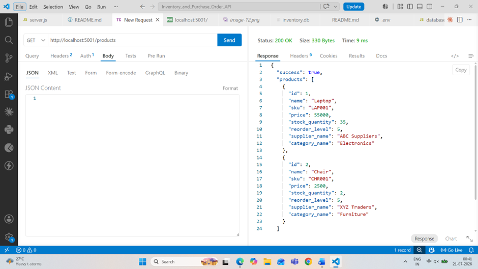

## 15. Stock Movement History

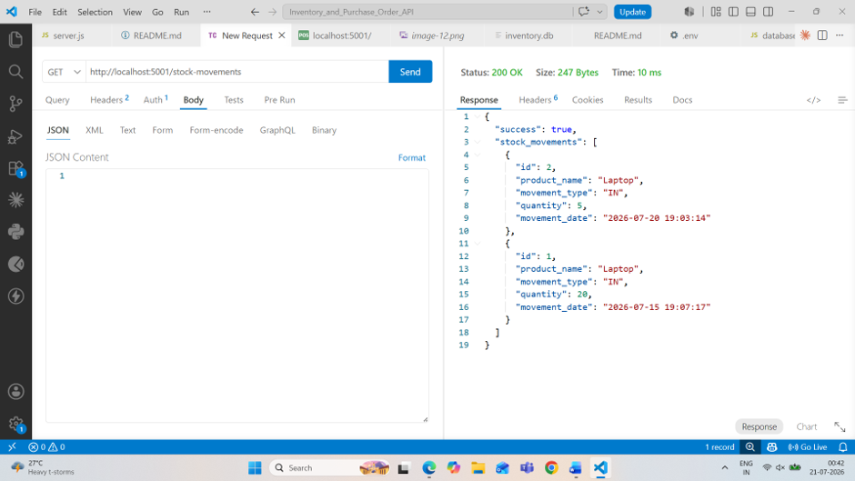

## 16. Supplier-wise Product Report

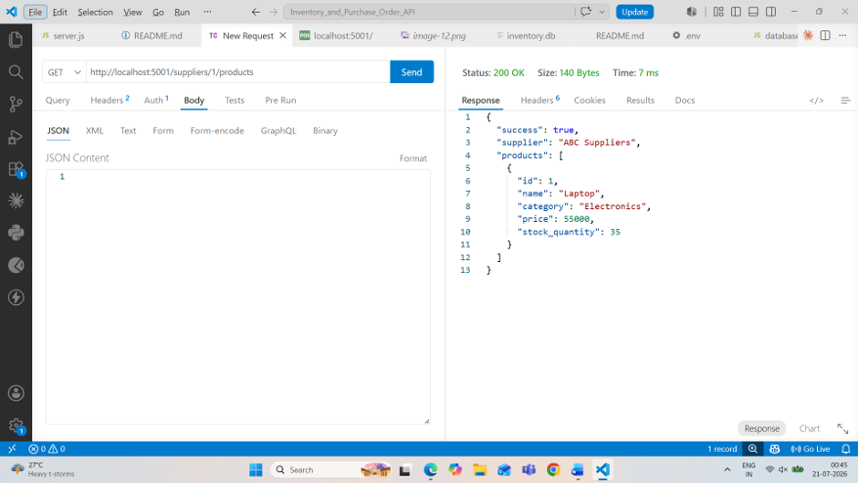

## 17. Delete Product

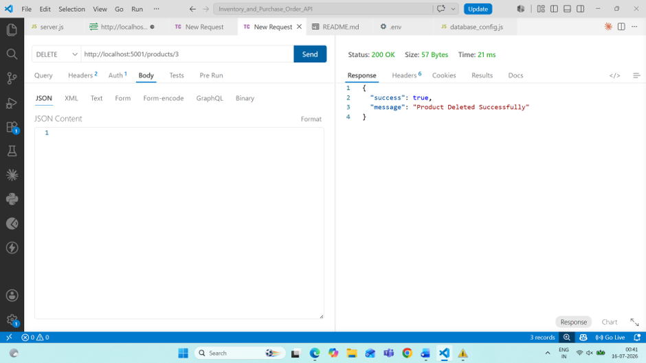

---

# Success Response

```json
{
  "success": true,
  "message": "Operation Successful"
}
```

---

# Error Response

```json
{
  "success": false,
  "message": "Something went wrong",
  "error": "Error details"
}
```

---

# Future Improvements

* Product Search
* Pagination
* Sorting
* Filtering
* Admin & Employee Roles
* Dashboard APIs
* Image Upload
* Swagger Documentation

---

# Author

**Sushmita Kambli**

B.Sc. Information Technology

Mumbai University

---

# License

This project is developed for learning purposes only.
